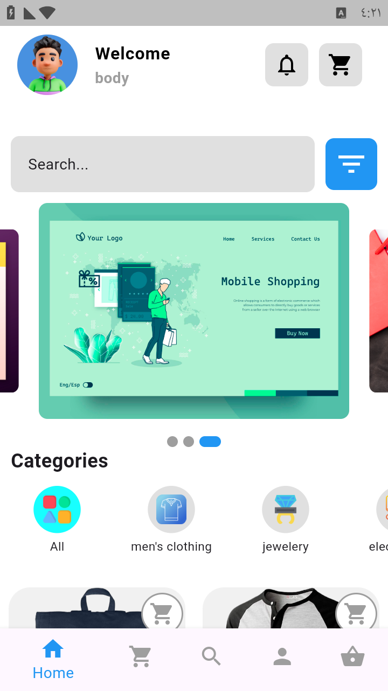
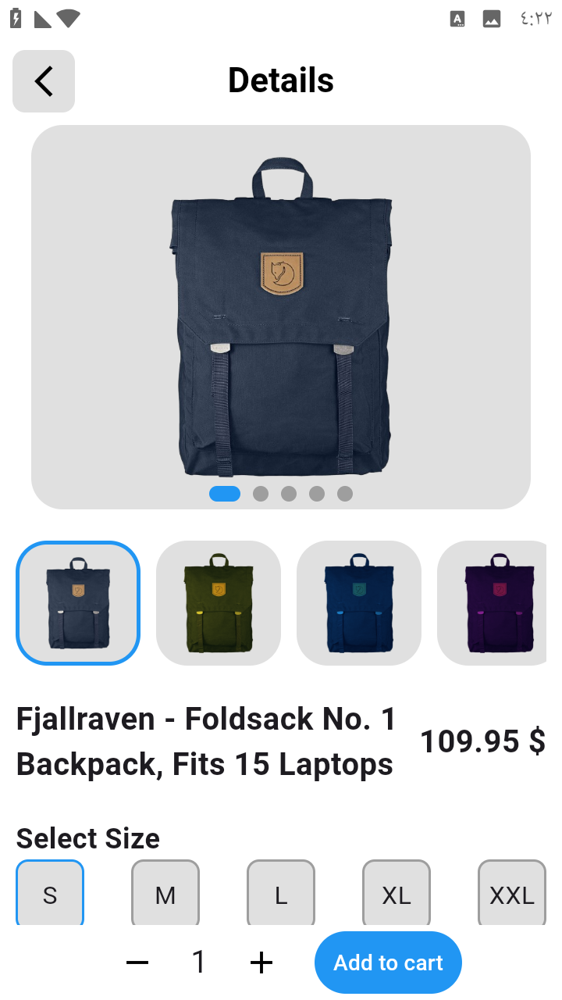
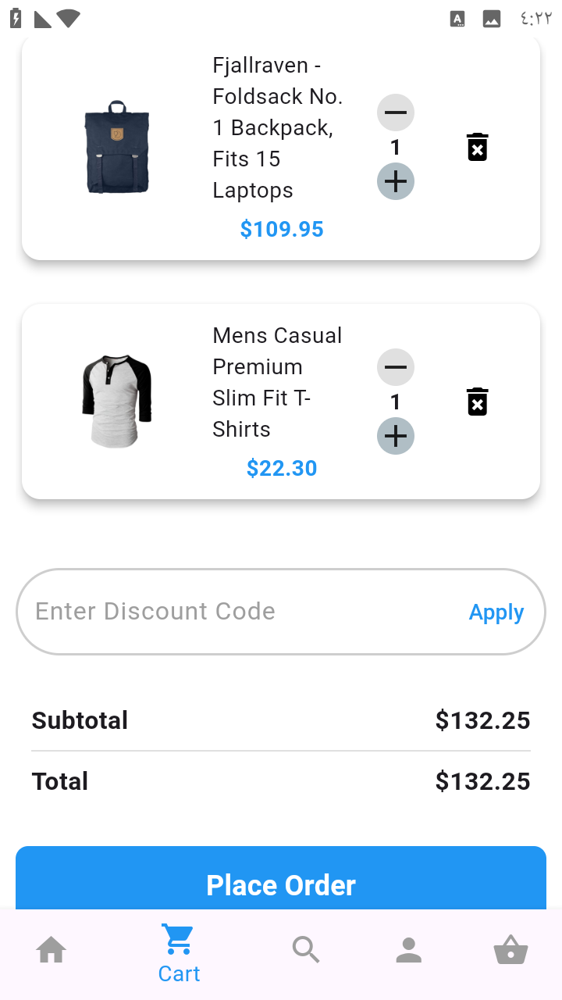
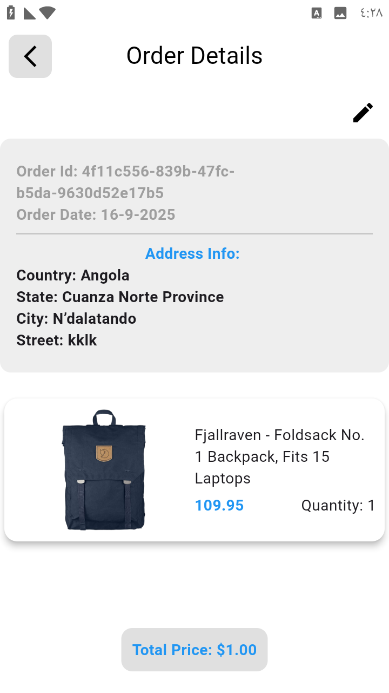
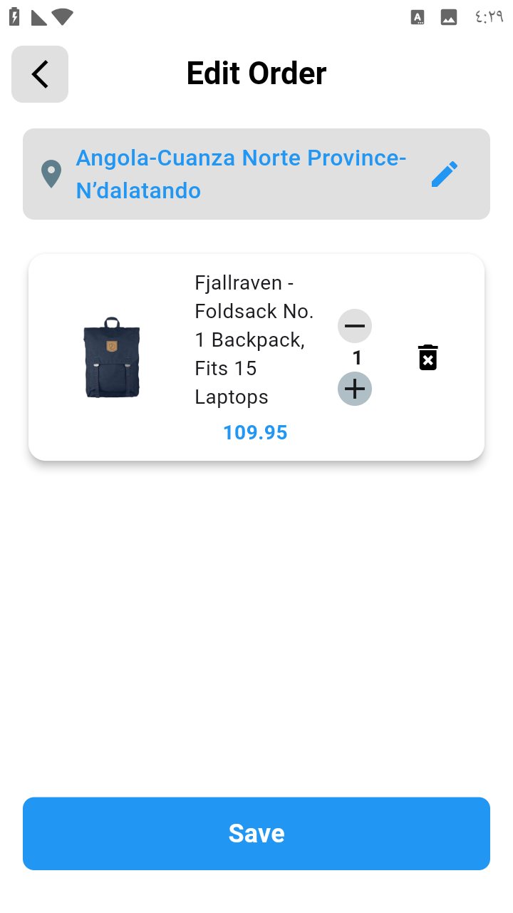
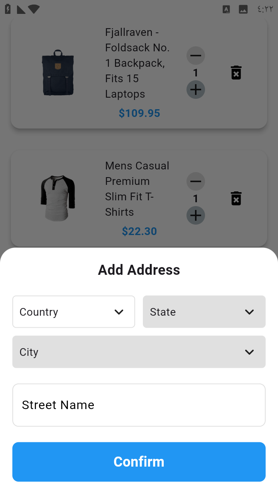

# 🛒 Cartsy

Cartsy is an **E-Commerce application** built with Flutter.  
It allows users to browse products, search, add them to the cart, place orders, and edit existing orders.

---

## ✨ Features
- Display a list of products.
- Search for products.
- Add products to the shopping cart.
- Manage orders (Add / Edit).
- Supports **RESTful API** for fetching data.
- Local storage with **SQLite** and **Shared Preferences**.
- Integration with **Firebase** for authentication and storage.
- Modern design using **Flutter & Dart**.

---

## 🖼️ UI Screenshots


<p float="left">
  
  
  
  
  
  
</p>


---

## 🛠️ Tech Stack
- **Flutter & Dart**
- **Bloc / Cubit** for state management
- **Firebase**
- **RESTful API**
- **SQLite**
- **Shared Preferences**

---

## 🚀 Getting Started
1. Clone the repository:
   ```bash
   git clone https://github.com/USERNAME/cartsy.git
   cd cartsy
=======
